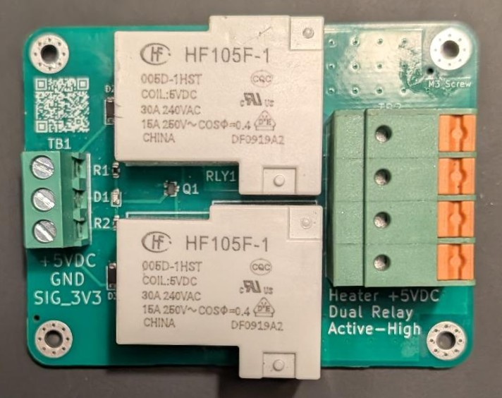
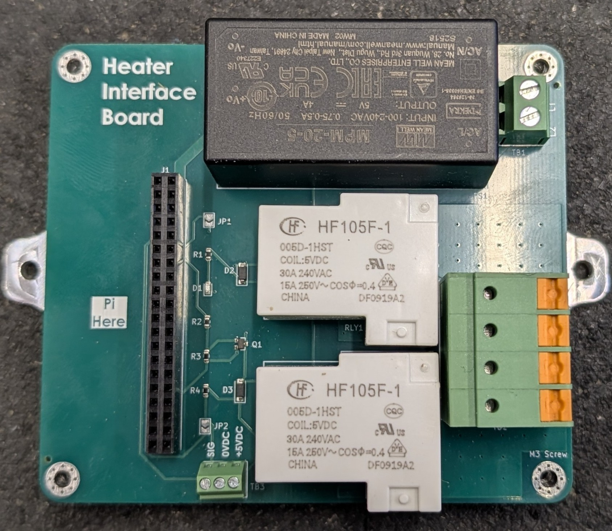

# Printed Circuit Board (PCB) Designs
The PCBs for this project are designed to consolidate and simplify multiple components to include the computer, power supply, and relays. A PCB allows for a robust and resistant design while simplifying connections between components.

There are two main PCB designs currently the relay board and the heater interface board. All PCBs were built by JLCPCB. If you would like the KiCad PCB files reach out to me via my contact information in my profile.
 
## Relay Board (Inactive)

### Overview & Purpose
The relay board was built to miniaturize and simplify the original relay PCB that was bought online. The off the shelf relay PCB had 3 terminals per relay of common (COM), normally open (NO), and normally closed (NC). So the custom relay board was built to only use COM and NO terminals that made the board overall smaller. A NO connection was chose because in a de-energized state that would default the heater to being off.

### Design
The board was originally designed in EasyEDA but now is designed in KiCad because KiCad is a more commonly used program, open source, and is used with more complex designs. Overall the new custom board has a __13% smaller__ footprint.

### Additional Details
If you would like to see the specific PCB versions detailed  reference [PCB Design Overview](./PCB%20Design%20Overview.pdf).

## Heater Interface Board (Active)

### Overview & Purpose
The heater interface board is the next evolution of PCB design for this project this board interfaces the computer, power supply, and relays together. An all in one design allows for a smaller footprint and less wires.

### Design
Designing this PCB has been completely done within KiCad. The main components on this board are the power supply (240VAC to 5VDC), electromechanical relays, terminal blocks, and the Raspberry Pi GPIO pin header. This boards footprint is __35% smaller__ than the original board first used in the project with the separate off the shelf relay board, power supply, and computer all being completely separate.

### Where the System is Currently

Install Date: Jan 1st, 2026

The heater has been working exceptionally well with no signs of wear or extreme heat fluctuations when the board is under load running the heater. __Additional documentation is in progress to show how to use this Heater Interface Board.__