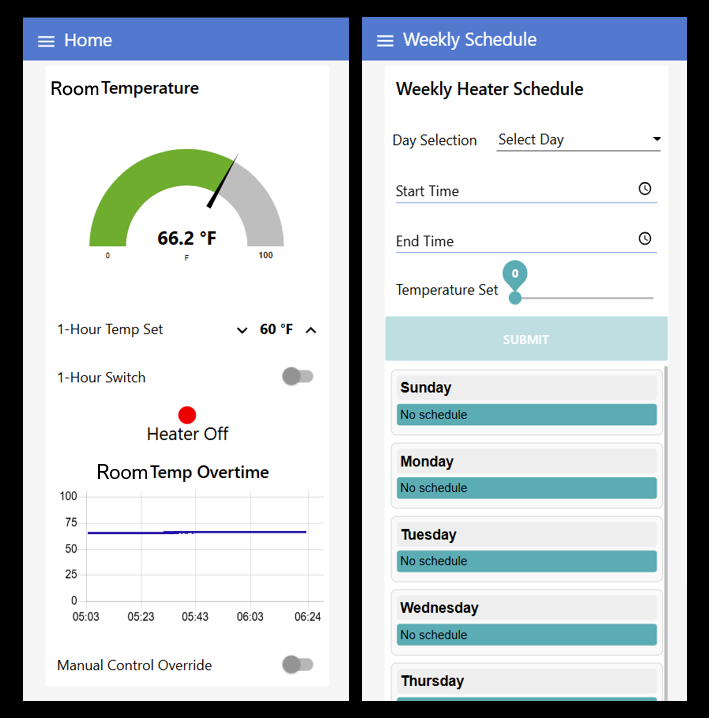

# Dr Infrared Heater Remote Thermostat

Controls a Dr Infared Heater ([DR-996](https://drheaterusa.com/products/dr966-240-volt-hardwired-shop-garage-commercial-heater-3000-watt-6000-watt)) over a local Wi-Fi network.

This project uses a [Raspberry Pi Zero 2W](https://www.raspberrypi.com/products/raspberry-pi-zero-2-w/) with Raspbian GNU/Linux 12 (bookworm) with [Node-RED](https://nodered.org/) to build the logic of the thermostat.  
Along with this a relay is used to control the heater to turn it on or off depening on the room temperture.  
  
## User Pages  


# Software Setup
## Raspberry Pi
Install Raspberry Pi OS using [Raspberry Pi Imager](https://www.raspberrypi.com/software/) on to Mirco SD card.
1. Update and Upgrade OS
```bash
sudo apt update && sudo apt upgrade -y
```  
2. [Install Node-RED](https://nodered.org/docs/getting-started/raspberrypi)  
```bash
bash <(curl -sL https://github.com/node-red/linux-installers/releases/latest/download/update-nodejs-and-nodered-deb)
```  
3. Enable Node-RED Service to run on boot  
```bash
sudo systemctl enable nodered.service
```  
4. Start Node-RED  
```bash
node-red-start
```  

## Node-RED
### RPi.GPIO Library Install
Depending on your raspberry pi OS version you may need to install/update the [RPi.GPIO](https://pypi.org/project/RPi.GPIO/) library. Command to install:
```bash
sudo apt install python3-rpi.gpio
```

Reboot your system to refresh everything once installed:
```bash
sudo reboot
```

### Access and Flows
1. Find the IP address or Hostname
```bash
hostname && hostname -I
```  
2. Enter IP address or hostname at port 1880 (default Node-RED port) into a web browser  
```bash
http://<your IP or hostname>:1880
```  
3. Login to the Node-RED website  
4. Install [npm](https://www.npmjs.com/) packages from the manage pallet. Install the following:  
[node-red-dashboard](https://flows.nodered.org/node/node-red-dashboard) and [node-red-contrib-sensor-ds18b20](https://flows.nodered.org/node/node-red-contrib-sensor-ds18b20)  
5. Import the [Flows.json](./Flows.json) file ([Node_RED importing guide](https://nodered.org/docs/user-guide/editor/workspace/import-export))  
6. Deploy the new flows  
7. Enter the following in to a web browser to access the user interface
```bash
http://<your IP or hostname>:1880/ui/
```

### Flow Files
The Node-RED flows maintain two files the HeaterSchedule.json and HeaterState.log. The HeaterSchedule.json holds the time periods for the heater to maintain a temperature. Then the HeaterState.log writes when the heater turns on and off and logs the source that caused the heater to turn on or off.  
  
An [example heater schedule](./ReadMeAssets/ExampleHeaterSchedule.json) is located in the ReadMeAssets and is described below:  
Sunday - The system will hold 70°F from 8am to 10am  
Monday - The system will hold 65°F from 9am to 11am and will hold 77°F from 2pm to 3pm  
Tuesday, Wednesday, Thursday, Friday, Saturday - No time periods


### Details
For more information on how the Node-RED flows work reference _____

## nginx and Remote Access
### nginx Reverse Proxy (Optional)
[nginx](https://nginx.org/) is used as a simple reverse proxy to allow a hostname such as `http://<your IP or hostname>.local` to show the Node-RED user interface (ui) dashboard website which defaults to `http://<your IP or hostname>.local:1880/ui/` and makes the overall user exprience simpler. Below are the steps of how to setup nginx.  
1. Install nginx
```bash
sudo apt update
sudo apt install nginx -y
```
2. Create Node-RED site
```bash
sudo nano /etc/nginx/sites-available/nodered
```
3. Add contents below and change __XXXXX__ to your own hostname
```
server {
    listen 80;
    server_name XXXXX.local;

    # Redirect root to /ui
    location = / {
        return 301 /ui;
    }

    # Proxy /ui to Node-RED
    location /ui/ {
        proxy_pass http://127.0.0.1:1880/ui/;
        proxy_http_version 1.1;
        proxy_set_header Upgrade $http_upgrade;
        proxy_set_header Connection "upgrade";
        proxy_set_header Host $host;
        proxy_set_header X-Real-IP $remote_addr;
        proxy_set_header X-Forwarded-For $proxy_add_x_forwarded_for;
        proxy_set_header X-Forwarded-Proto $scheme;
    }
}
```
4. Point to Node-RED site by linking
```bash
sudo ln -s /etc/nginx/sites-available/nodered /etc/nginx/sites-enabled/
```
5. Remove default nginx site from sites enabled folder (optional but recommended)
```bash
sudo rm /etc/nginx/sites-enabled/default
```
6. Test and reload nginx
```bash
sudo nginx -t
sudo systemctl reload nginx
```
7. Navigate to your `http://XXXXX.local` (server name you put in at step 3)
  
Note - nginx steps assisted in creation with OpenAI ChatGPT.

### Remote Access to the Raspberry Pi (Optional)
A native feature for Raspberry Pi's is their [Raspberry Pi Connect](https://www.raspberrypi.com/software/connect/) software that allows secure remote access to your Raspberry Pi. Below I have quick instructions to get this working using a headless (no desktop) Raspberry Pi but is best to reference the official Raspberry Pi Connect [documentation](https://www.raspberrypi.com/documentation/services/connect.html).  

1. Install Raspberry Pi Connect
```bash
sudo apt install rpi-connect-lite
```
2. Turn on
```bash
rpi-connect on
```
3. Enable user lingering to automatically re-login after reboot
```bash
loginctl enable-linger
```
4. Generate hyperlink to login to Raspberry Pi Connect and add your Pi
```bash
rpi-connect signin
```
5. Use the Raspberry Pi Connect website to remotely connect to your Pi.  
# Hardware
## Bill of Materials (BOM)
A [bill of materials](./ReadMeAssets/DrInfraredHeaterRemoteThermostat_BOM.xlsx) has been provided and is located in ReadMeAssets folder.

## Mounting Components
### Mounting to the Heater
The Raspberry Pi Zero 2W, 5v power supply and relays are mounted to the [HeaterBackMountPlate](./ReadMeAssets/HeaterBackMountPlate.stl) then that is attached to the back of the Dr Infared Heater by two short sheet metal self taping screws. This mount was 3D printed with PETG (Polyethylene Terephthalate Glycol) the [HeaterBackMountPlate.stl](./ReadMeAssets/HeaterBackMountPlate.stl) file is located in the ReadMeAssets folder.

### Mounting the Temperature Probe
The DS18B20 temperature probe should be at ran as far as possible from the heater and about 60 inches (152cm) from the floor. The reason to put the probe as far as possible from the heater is to allow time for the heat to reach the temeperture probe and evenly heat the room. The mount for the temperture probe screwed to the wall was 3D printed with PETG the [TemperatureProbeCase.stl](./ReadMeAssets/TemperatureProbeCase.stl) file is located in the ReadMeAssets folder.

## Wiring
To wire the heater you should reference the [DR-966 Manual](./ReadMeAssets\DR-966Manual.pdf) in the ReadMeAssets folder or find it on the Dr Infared Heater [website](https://drheaterusa.com/products/dr966-240-volt-hardwired-shop-garage-commercial-heater-3000-watt-6000-watt) for the DR-966. I have included a [wiring diagram](/ReadMeAssets/WiringDiagram.pdf) for how to wire the heater starting from the heavy gauge wires running from your circuit breaker panel to the heater. The wiring diagram also notes the wire gauges that I used.

## Safety
Needs info _____